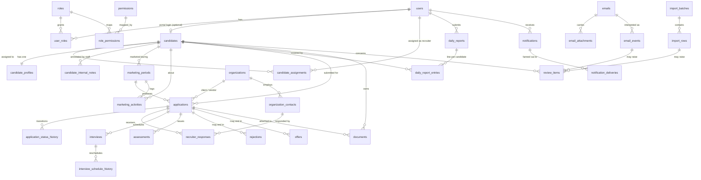

# 01 — Domain Model & Relationships

## 1. The core sentence

> A **candidate** is marketed by an assigned **recruiter** during a **marketing period**.
> During that period, **applications** are submitted on the candidate's behalf. Each
> application may draw **recruiter responses**, which may lead to **interviews** and
> **assessments**, and terminate in a **rejection** or an **offer**. All of this activity is
> summarised daily in **daily reports** and rendered chronologically as the candidate
> **timeline**.

Every table below exists to make one clause of that sentence precise.

## 2. Entity groups

### Group A — Identity, tenancy & access
`business_units` · `users` · `roles` · `user_roles` · `permissions` · `role_permissions`

### Group B — Candidate
`candidates` · `candidate_profiles` · `candidate_assignments` · `candidate_internal_notes`

### Group C — Marketing
`marketing_periods` · `marketing_activities`

### Group D — Pipeline (verified records)
`applications` · `application_status_history` · `recruiter_responses` · `interviews` ·
`interview_schedule_history` · `assessments` · `rejections` · `offers`

### Group E — Operations
`daily_reports` · `daily_report_entries` · `notifications` · `notification_deliveries` ·
`documents`

### Group F — Interpretation & Governance
`ingest.emails` · `ingest.email_attachments` · `ingest.email_events` · `review_items` ·
`record_provenance` · `audit.audit_logs`

### Group G — Migration
`staging.import_batches` · `staging.import_rows`

### Group H — [PROPOSED ADDITION] External parties
`organizations` · `organization_contacts`

## 3. Entity–relationship diagram

## 4. Relationship rules that matter

### 4.1 Candidate is a person, not an engagement
One human being = one `candidates` row, forever. If they are marketed, stop, and are marketed
again six months later, that is **two `marketing_periods` rows on the same candidate**, not
two candidates. This keeps the timeline, documents, and history continuous, and it is the
only shape that makes "how many times have we marketed this person" answerable.

### 4.2 Assignment is a history, not a pointer
`candidate_assignments` is append-only with an `unassigned_at` timestamp. We never delete or
overwrite an assignment row. Two reasons: recruiter access must be reconstructable for any
past date during audit, and "who owned this candidate when the offer came in" is a real
question. Active assignment = `unassigned_at IS NULL`. At most one active `is_primary`
assignment per candidate, enforced by a partial unique index.

### 4.3 Applications hang off a marketing period
`applications.marketing_period_id` is **NOT NULL**. An application that does not belong to a
marketing period is a data-entry error, not a valid state — the period is what makes the
activity accountable. `candidate_id` is also stored (denormalised) with a composite FK back
to `marketing_periods(id, candidate_id)` so the two can never disagree.

### 4.4 Interviews, assessments, rejections and offers are candidate-anchored, application-linked
Each carries a **required `candidate_id`** and an **optional `application_id`**.

This asymmetry is deliberate and it is the single most important modelling choice in the
pipeline. Email intelligence will, in the future, detect "an interview was scheduled for
Priya on Thursday" from a message that gives no clue which application it belongs to. That
fact is real and must be recordable. Forcing `application_id NOT NULL` would mean the system
must either invent an application (fabricating a record) or drop the fact (losing it). Both
are unacceptable. Instead the record is created unlinked, and a `review_item` is raised to
link it.

### 4.5 Status is stored *and* historied
Every pipeline record carries a current `status` column (fast to query, easy to index) **and**
appends to a `*_status_history` table on every transition. The current value is a cache of
the last history row. A trigger keeps them consistent; the history table is the source of
truth if they ever diverge.

### 4.6 Rejections and offers are records, not just statuses
They could have been `status = 'rejected'` on the application. They are separate tables
because: they arrive independently of applications (see 4.4), they carry their own fields
(reason category, offer terms, dates), they are counted and reported on directly, and they
are terminal facts that should not be erasable by a subsequent status edit on the parent.
Inserting a rejection *drives* the application status transition; it is not driven by it.

### 4.7 Internal notes are never columns on candidate-visible rows
`candidate_internal_notes` and `application_internal_notes` are separate tables with
internal-only RLS. There is no `internal_notes` column on `candidates` or `applications`.
See [05 — Security Model](./05-security-model.md) §3 for why this is a hard rule and not a
stylistic one.

### 4.8 [PROPOSED ADDITION] Organizations
The brief mentions identifying "potential staffing/third-party recruiters." That requires a
place to put a company. I propose `organizations` (with `kind` in client / vendor /
implementation_partner / staffing_agency / unknown) and `organization_contacts`.

Without it, applications store client and vendor names as free text, which means: no
deduplication, no "how many submissions to Company X," and no way for email intelligence to
recognise a repeat vendor. With it, we can start free-text and resolve to organizations
progressively.

**Approved (D-14).** The tables are created in V1 with a free-text fallback column
(`client_name_raw`) so data entry is never blocked by a missing organization record.

## 5. What the candidate can see

The portal exposes a strict subset, **read-only** (D-01 resolved). Its exact width is still a
*product* decision — [DECISION NEEDED] (see doc 15, D-02). The architecture supports any
width via the `portal_*` views without schema change.

| Entity | Candidate visibility (proposed default) |
|---|---|
| Own candidate + profile | Read |
| Own documents where `visibility = 'candidate_visible'` | Read + download |
| Own marketing periods | Read (dates + status only) |
| Own applications | Read (role, company, date, status) — **no** vendor/rate/internal fields |
| Own interviews | Read (schedule, mode, status, joining details) |
| Own assessments | Read (type, due date, status, result) |
| Own offers | Read |
| Own rejections | **Hidden by default** — [DECISION NEEDED] |
| Own timeline | Read (filtered event types) |
| Recruiter responses | Hidden |
| Marketing activities | Hidden |
| Daily reports, review items, audit logs, emails | Hidden — never exposed |
